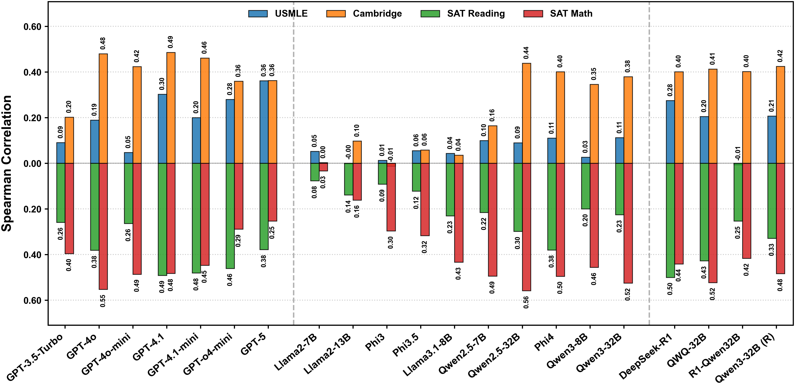

# Can LLMs Estimate Student Struggles? Human-AI Difficulty Alignment with Proficiency Simulation for Item Difficulty Prediction

📖 [Can LLMs Estimate Student Struggles? Human-AI Difficulty Alignment with Proficiency Simulation for Item Difficulty Prediction](https://github.com/MingLiiii/Difficulty_Alignment)

🔥🔥 This is the repo for the **Human-AI Difficulty Alignment** project, which systematically investigates whether LLMs understand item difficulties similar to humans. 

The repo contains: 

- The formulated datasets for our analysis, including USMLE, Cambridge, SAT Math, and SAT Reading & Writing. 
- All the responses generated by the models mentioned in our paper, including 4tasks, 21 models, and 8 prompting scenarios.
- The basic analysis code for the model's difficulty-perception results and problem-solving results. 

(Feel free to email Ming ([Homepage](https://mingliiii.github.io/), [Email](minglii@umd.edu)) for any questions or feedback.)

## Contents
- [Overview](#overview)
- [Key Findings](#key-findings)
- [Directory Structure](#directory-structure)
- [Run Code](#run-code)

## Overview

Accurate estimation of item (question or task) difficulty is critical for educational assessment but suffers from the cold start problem. While Large Language Models demonstrate superhuman problem-solving capabilities, it remains an open question whether they can perceive the cognitive struggles of human learners. 
In this work, we present a large-scale empirical analysis of **Human-AI Difficulty Alignment** for over 20 models across diverse domains such as medical knowledge and mathematical reasoning. 
Our findings reveal a systematic misalignment where scaling up model size is not reliably helpful; instead of aligning with humans, models converge toward a shared machine consensus. 
We observe that high performance often impedes accurate difficulty estimation, as models struggle to simulate the capability limitations of students even when being explicitly prompted to adopt specific proficiency levels. 
Furthermore, we identify a critical lack of introspection, as models fail to predict their own limitations. 
These results suggest that general problem-solving capability does not imply an understanding of human cognitive struggles, highlighting the challenge of using current models for automated difficulty prediction.
    
<p align="center" width="90%">
<a ></a>
</p>

## Key Findings

* 🔎 **Systematic Misalignment**: Contrary to standard capability metrics, scaling does not reliably translate into alignment. Increasing model scale does not improve difficulty predictions; instead, models form a cohesive Machine Consensus, aligning significantly stronger with each other than with human reality.

* 🔎 **Limits of Simulation**: Neither extrinsic ensembling nor proficiency simulation serves as a reliable fix for the misalignment. Ensemble performance is strictly bounded by weaker models, while proficiency simulation proves highly inconsistent as models struggle to authentically mimic different proficiency levels.
    
* 🔎 **The Curse of Knowledge**: Our IRT-based analysis reveals a fundamental mechanistic divergence: the difficulty derived from models' actual correctness correlates even worse with humans than their explicit perceptions. Items that are difficult for humans are frequently trivial for models, and this capability exhibits significant inertia even under weak student prompts.
    
* 🔎 **Metacognitive Blindness**: We identify a critical lack of introspection. With AUROC scores hovering near random guessing, models fail to predict their own limitations, indicating that explicit difficulty estimates are effectively decoupled from the model's actual correctness, lacking the internal signal to ground their predictions.

## Directory Structure

### `data/`
Contains the formatted datasets used in the analysis.

```text
data/
├── Cambridge/
│   └── Cambridge_formatted.json
├── SAT_math/
│   └── SAT_math_ formatted.json
├── SAT_reading/
│   └── SAT_reading_ formatted.json
└── USMLE/
    └── USMLE_ formatted.json
```

**Data Format (`.json`):**
A list of dictionaries, where each dictionary represents a question item.

**Example (Cambridge):**
```json
{
    "processed_text": "Below is a Multiple Choice Question for Reading Comprehension...\nQuestion: ...\nOptions: ...",
    "difficulty": 68.84,      // Item difficulty
    "discrimination": 0.419,  // Item discrimination parameter
    "facility": 0.846,        // Item facility (correctness rate)
    "answer": "a",            // Correct answer key
    "original_question_dict": { ... }, // Original raw data
    "original_passage_id": 3
}
```

**Example (USMLE):**
```json
{
    "processed_text": "Below is a Multiple Choice Question from United States Medical Licensing Examination (USMLE) STEP 1...\nQuestion: ...",
    "Difficulty": 0.52,       // Note the capitalization difference in some datasets
    "Response_Time": 75.21,
    "answer": "E",
    "ori_data": { ... }
}
```

**Example (SAT Math):**
```json
{
    "processed_text": "Below is a SAT Math question...\nQuestion: ...",
    "Difficulty": "Hard",     // Categorical difficulty
    "answer": "B",
    "ori_data": { ... }
}
```

### `model_results/`
Contains the model outputs for different experimental conditions. Each subdirectory contains `.jsonl` files for different models and tasks.

#### Result Directories:
*   `diff/`: **Difficulty Prediction**. Models are asked to predict the difficulty of the item.
*   `diff_role_weak/`, `diff_role_medium/`, `diff_role_strong/`: Difficulty Prediction with proficiency simulation (Weak, Medium, Strong).
*   `direct/`: **Direct Answering**. Models are asked to solve the problem directly.
*   `direct_role_weak_result/`, `direct_role_medium_result/`, `direct_role_strong_result/`: Direct Answering with proficiency simulation (Weak, Medium, Strong).

#### Result Format (`.jsonl`):
Each line is a JSON object extending the original data format with the model's response.

**Example (Difficulty Prediction - `diff/`):**
```json
{
    "processed_text": "...",
    "difficulty": 0.52,
    "answer": "E",
    "model_response": "The difficulty of this question can be broken down as follows...\nOverall, this question would be considered moderately difficult... The final difficulty value would be \\boxed{0.7}."
}
```

**Example (Direct Answering - `direct/`):**
```json
{
    "processed_text": "...",
    "difficulty": 0.52,
    "answer": "E",
    "model_response": "To answer this question, we need to know the anatomy...\nTherefore, the correct answer is \\boxed{(E) Right hepatic}.",
    "Correct": true     // Indicates if the model's answer matches the ground truth
}
```


## Run Code
1. Get the plot for LLM difficulty perception results
```
python perception_result_plot.py
```
```--role_condition```: Used to select the prompt scenario. 

2. Get the table for LLM difficulty perception results
```
python perception_result_table.py
```
```--role_condition```: Used to select the prompt scenario. 

3. Get the problem-solving accuracy
```
python capability_result.py
```


